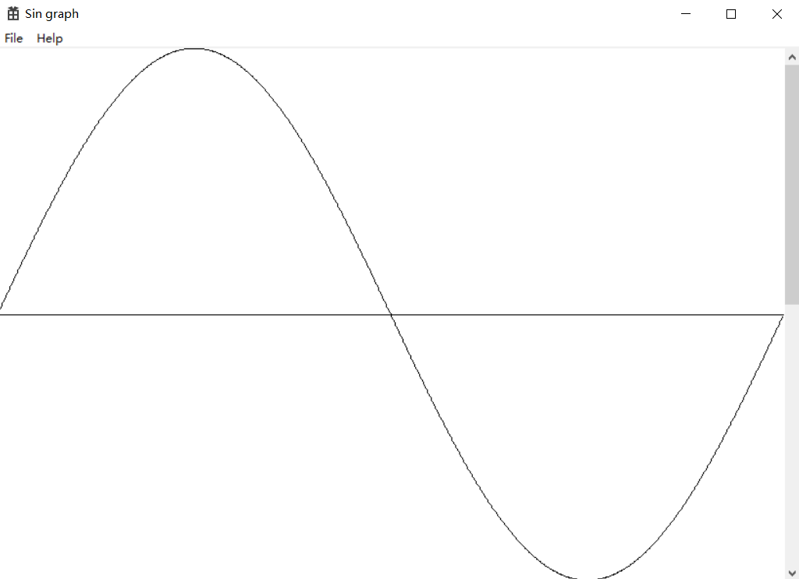
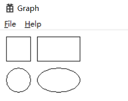
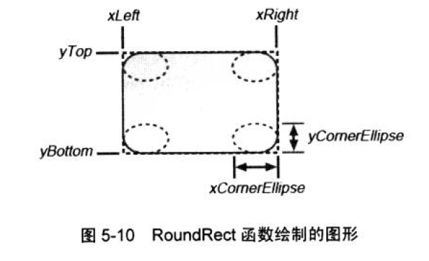
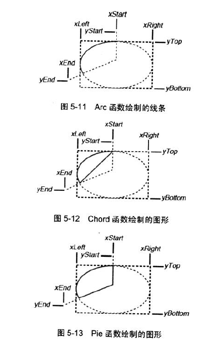
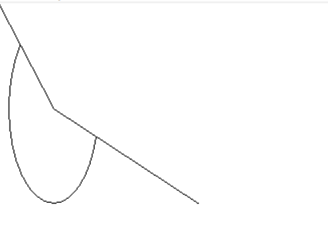
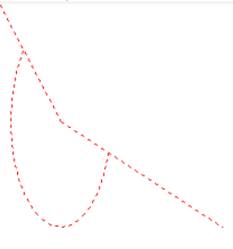
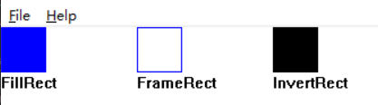

# 绘图基础

# 画直线：

## 1. `MoveToEx()`与`LineTo()`函数绘图
`LineTo()`函数会修改起始点坐标为传入参数。

```cpp
//MoveToEx()函数设置画图的起始点
//LineTo的参数指定了线的终点在哪里
//在客户区画出坐标(100,100)与(200,200)的连线
MoveToEx(hdc,100,100,NULL);
LineTo(hdc,200,200);
```

## 2. `PolyLine()`与`PolyLineTo()`绘图
PolyLine会从当前的起始点（但不包括起始点）开始画图。PolyLineTo从起始点开始进行画图.

```cpp
POINT a[10]{ 100,100,200,100,200,200,100,200,100,100 };
PolyLine(hdc,a,5);
```

# 绘制Sin函数曲线：

```cpp
MoveToEx(hdc, 0, cyClient / 2, NULL);
LineTo(hdc, cxClient, cyClient / 2);
for (int i = 0; i < NUM; i++)
{
    apt[i].x = i * cxClient / NUM;
    apt[i].y = cyClient / 2 * (1 - sin(TWOPI*i/NUM));
}
Polyline(hdc, apt, NUM);
```



# 画几何图形：

## 1. 矩形与椭圆：

```cpp
//Rectangle(HDC,xLEFT,yTOP,xRIGHT,yBOTTOM)
//Ellipse(HDC,xLEFT,yTOP,xRIGHT,yBOTTOM)
Rectangle(hdc, 10, 10, 50, 50);
Rectangle(hdc, 60, 10, 130, 50);
Ellipse(hdc, 10, 60, 50, 100);
Ellipse(hdc, 60, 60, 130, 100);
```

   
&ensp;


## 2. 圆角矩形：

```cpp
//RoundRect(HDC,xLEFT,yTOP,xRIGHT,yBOTTOM,xCornerEllipse,yCornerEllipse);
//圆角矩形的圆角由后两个参数决定，相当于放了一个椭圆在边角处
RoundRect(hdc, 0, 0, 100, 200, 30, 40);
```



## 3. 椭圆的分割图

饼图的函数有多个

```cpp
//Arc为一段弧，两个分割的点可以在任何地方，弧线由两个分割点与心连线分割
//Arc(HDC,xLEFT,yTOP,xRIGHT,yBOTTOM,xStart,yStart,xEnd,yEnd);
//Chord(HDC,xLEFT,yTOP,xRIGHT,yBOTTOM,xStart,yStart,xEnd,yEnd);
//Pie(HDC,xLEFT,yTOP,xRIGHT,yBOTTOM,xStart,yStart,xEnd,yEnd);

```



- 弧线：

```cpp
MoveToEx(hdc, 55, 105,NULL);
LineTo(hdc, 0, 0);
MoveToEx(hdc, 55, 105, NULL);
LineTo(hdc, 200, 200);
Arc(hdc,10, 10, 100, 200,0,0, 200, 200);
```

  
&emsp;  

# 使用现有画笔： 

调用画线函数的时候，Windows通过当前设备环境的画笔来绘制。
——画笔决定了线条的**颜色、宽度和样式**。  

- `CreatePen()`创建一个画笔对象，保存画笔的相关信息。    
- `SelectPen(HDC,HPEN)`设置绘图使用此画笔，**该函数返回上一个选定的画笔**。
- `GetCurrentObject(HDC,OBJ_PEN)`获取当前被选入设备环境的句柄
- `DeleteObject(HPEN)`删除画笔对象
  
```cpp
//第一种初始化画笔的方法
HPEN hpen;
hpen = CreatePen(PS_DOT, 3, RGB(255, 0, 0));
SelectObject(hdc, hpen);

//第二种
SelectObject(hdc, CreatePen(PS_DOT, 3, RGB(255, 0, 0)));
```




## 填充空隙：

现在使用虚线的话，那么线中为空部分的颜色为背景模式和背景颜色决定。

```cpp
SetBkColor(hdc,RGB(0,0,255));
```

效果如图所示：  


 
# 使用画刷： 

- `Polygon()`：接受环境句柄，代表点坐标的`POINT`类型数组，点的个数。如果起始点和结尾点不相同，则将结尾点和起始点连接在一起。
- `CreateSolidBrush()`:指定填充颜色，可以使用RGB作为参数颜色的输入
- `CreateHatchBrush()`:指定填充线条和填充颜色  

```cpp
SelectObject(hdc, CreateSolidBrush(RGB(0,0,255)));
Ellipse(hdc,0,0,200,200);

SelectObject(hdc, CreateHatchBrush(HS_CROSS,RGB(0,0,255)));
Ellipse(hdc,0,0,200,200);
```


# GDI映射模式   
&emsp;&emsp;以像素为单位进行绘图很棒，这是默认状况。有没有别的方法呢？`TextOut`中需要起始的xy坐标，这个坐标是**逻辑单位**.但显示的时候是在设备上的，需要将逻辑单位转换成**设备单位**，即转换成像素.这些转换以映射模式，窗口原点，视口远点、窗口范围和视口范围共同决定。  

映射模式决定**随着显示区向右移动x的增减性，向下移动y的增减性**。

这部分略过去，之后有兴趣（有需求再来看吧）。。。


# 处理矩形： 

## 几个常用的Rect函数：
```cpp
RECT rect1{ 0,0,40,40 }, rect2{ 120,0,160,40 }, rect3{240,0,280,40};
FillRect(hdc, &rect1, hBrush);
FrameRect(hdc, &rect2, hBrush);

//InvertRect翻转矩形框中的所有像素，1变为0，0变为1.
InvertRect(hdc, &rect3);
TextOut(hdc, 0, 41, TEXT("FillRect"),8);
TextOut(hdc, 120, 41, TEXT("FrameRect"), 9);
TextOut(hdc, 240, 41, TEXT("InvertRect"), 10);
```
### 这里给出了三个函数的Demo，下面是示意图。^_^  

&nbsp;
   

### `InvertRect`
&emsp;&emsp;`InvertRect`比较特殊，他并不是画出一个图，而是把原图的颜色翻转。下图所示为对上图`FillRect`与`FrameRect`的翻转操作，操作结果显然.  

  

## 随机矩形：